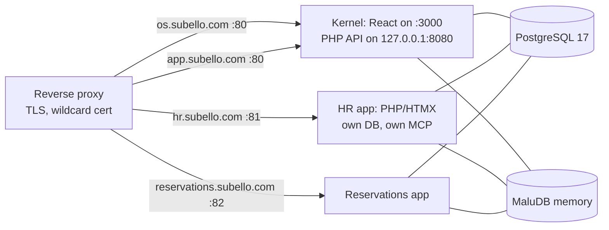
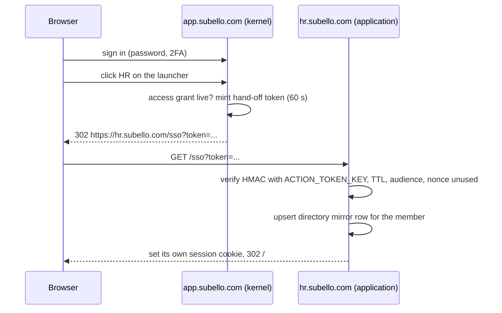
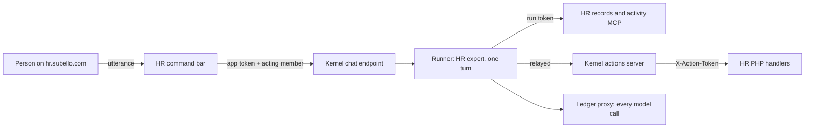

# Business OS — Kernel and Integration Design

2026-09-22 · Edward Honour

> Living review copy: https://claude.ai/code/artifact/7f923c54-5189-41ee-bdb0-95cd6610ccfa
> Comments and edits happen there; this file is the repo snapshot. The plugin that implements the
> application side is `maludb-os-integration` (`~/maludb-os-integration`, skill `os-integration`, 0.2.0).

## The decision (2026-09-22)

The Business OS is a kernel: it manages the AI agents, the humans who administer those agents directly, and single sign-on. It does not run the business's applications. The consensus after reviewing the platform was that too many business applications had been built into it; like a real operating system, the use of applications belongs in the applications.

A typical company therefore has three kinds of name. For a restaurant called Subello:

| Name | What it is | Who uses it |
| --- | --- | --- |
| www.subello.com | The public website. Out of scope; a design fixture only | The public |
| os.subello.com | This platform, the kernel: the operating environment, locations, company structure, the definition of every human user, the agent workforce | AI agents, and super-admins only |
| app.subello.com | The single sign-on landing page: sign in, then the launcher of the applications the person is granted. Nothing else | Every human who works here |
| hr.subello.com, reservations.subello.com, … | The applications, one host name each, on Apache, PostgreSQL 17, PHP and HTMX. Each ships full MCP coverage and its own expert agent | The people granted access, and the agents granted tools |

os.subello.com and app.subello.com are one codebase on two host names: the session lives in the kernel, so sign-on has to be issued from it. HR is the first application, because the directory hand-off must exist before any application can sign people in. The build of HR does not start until the integration skill and this shared design are in place. The desktop companion is deferred.

## The boundary

The rule: **the kernel owns who exists, where they belong and which agents work; applications own the work itself.** A thing stays in the kernel only if an agent, the estate or sign-on needs it.

| Kernel keeps | What it is for |
| --- | --- |
| Home | The super-admin's overview: the workforce and what each agent is doing now |
| Estate | Buildings, offices (VMs), desks; where agents run and applications reside |
| Departments and org chart | The Front Office as root, the five standing departments (IT since 2026-09-27), managers, membership |
| Directory (People) | Every human and agent as an identity: role, status, departments, grants, tokens, invitations. Not employment |
| Agent HR | Hires, versions, prompts, tool grants, duties, harnesses, the runner |
| Applications | The catalog, the registered applications, endpoints, access grants, business areas, the expert per application |
| Approvals | The queue and policies for agents' actions, decided by super-admins |
| AI Ops | The prompt ledger with dollar costs, runs, run events, verdicts, eval suites and runs, the period export |
| Skills and memory | The skills library, MaluDB activity memory, the activity log |
| Team, access and settings | Roles, module grants, navigation, business settings |
| Sign-on | Login, 2FA, the hand-off token, the launcher at app.subello.com |

| Leaves the kernel | Becomes |
| --- | --- |
| CRM and contacts, Sales and invoicing, Expenses, Books and bank reconciliation, Projects and tasks, Calendar, Time, Tickets, Shared inbox, Documents, Signatures, Inventory, Content, Portal and forms, Reports, Assets, Company profile | An application from us, built when a customer needs it, on the HTMX stack |
| People: employment, pay runs, leave | The HR application, first to be built |
| My Work | The person half is gone; the agent half stays in Agent HR |
| The command bar on the OS screens and its assistant service | Removed. An application's own command bar is the application's feature |

Removal is complete: code, screens, MCP tools, manifest entries, menu entries, and one migration that drops the leaf tables and views, so the records server can no longer answer about them. The Applications module replaces Contacts/CRM as the exemplar every kernel slice copies. The three roles stay in the directory because applications read them, but only a super-admin can sign in to os.subello.com; a dept-admin is a directory fact for HR and the applications, not a kernel user. The standing departments stay seeded: each still names a kernel function (root of the org chart, people and agents, the token ledger, the evals — and since 2026-09-27 IT, the machines and the applications on them, home of the Sysadmin and the application installation agent).

## Hosts and the network layout

One office VM, one Apache, one reverse proxy in front. The kernel keeps the business's main name; every application is its own virtual host, by name or by port behind the proxy, exactly as decided on 2026-09-21.

Reading it: the proxy tells the names apart and hands each to its port on Apache; without a proxy Apache does it by name. Every application has its own database on the one PostgreSQL 17 and its own episodes, tagged by application, in the tenant's one MaluDB memory.

| Host | Serves | Who signs in |
| --- | --- | --- |
| os.subello.com | The kernel's screens. The React app reads the host name and shows the kernel routes; the PHP API refuses a non-super-admin session here | Super-admins. Agents never sign in; they hold run tokens |
| app.subello.com | The same React app in its person face: login, 2FA, password reset, profile, the launcher. The root, and so every sign-in, takes a person straight into their default application, or the only one they hold, and otherwise to the launcher, which says "You do not have access to any applications, please contact support." when they hold none (2026-09-26). Any other route redirects to the launcher | Every active human |
| `<app>.subello.com` | The application's HTMX screens; its MCP servers proxied under the same name at /mcp/records and /mcp/activity | Anyone with a live access grant, via the hand-off token |
| www.subello.com | The public website, not ours | Nobody |
| subello.com | A static landing page on its own Apache virtual host, `/var/www/landing`, showing the three doors *(2026-09-22)* | Anyone |

The kernel's public allow-list of PHP endpoints stays what it is (health, me, members, org-graph, the MCP proxies, the voice webhook) minus the ones that belonged to leaf modules (the calendar feed, the company profile). The session cookie is set for the exact host, never for the parent domain, so a cookie on app.subello.com never reaches an application: the hand-off token is the only way across. The old name subello.com redirects to app.subello.com.

## Identity and single sign-on

The kernel is the one identity. An application keeps no password and no account of its own; a house-signed hand-off token on the action token's pattern admits a person, and a live application access grant is what the token proves. OpenID Connect is not planned: we provide the applications ourselves, so a house token is enough.

**The token.** `{member_id}.{expires}.{app_key}.{nonce}.{hmac}`, HMAC-SHA256 with the tenant's `ACTION_TOKEN_KEY` over `"sso:member.exp.app.nonce"`. TTL 60 seconds, single use: the application records the nonce until it expires and refuses a second presentation. The audience is the application's catalog key, so a token for HR opens nothing else. The kernel mints one only for an active human with a live access grant on that application, and logs `application.sign_on` with the application and the member.

**What the application does with it.** It opens its own hardened PHP session for that member id (the plugin's `php-session-auth` rules), and refreshes its directory mirror from the claims carried beside the token in a signed JSON body: display name, e-mail, role, external flag, status, department ids, and whether the member is admin of each. The mirror is the application's `members` and `department_members` tables with **the kernel's ids**, so `app.member_id` and the MaluDB namespaces mean the same person everywhere. Nothing else about identity is stored in the application.

**Roles as directory facts.** `super_admin`, `dept_admin` and `user` travel with the token. The application decides what a dept-admin may do inside it (HR lets one approve leave for their departments); the kernel decides only who may sign in to os.subello.com, and that is super-admins alone.

**Signing out.** Sign-out on app.subello.com ends the kernel session and posts a signed `sso/logout` notice to every application the person signed on to in that session; an application's own sign-out ends only its own session. Revoking a grant or deactivating a member takes effect in the application on its next request, because every application request re-checks the mirror row's status, which the kernel updates through the directory feed below.

**Agents** are unchanged: a run token minted by the runner is their credential on MCP endpoints, and the kernel's actions server relays it to handlers. An agent never holds a hand-off token.

## The directory API

The kernel owns the directory: who exists, their role and status, which departments they belong to, who manages each department. HR owns employment: contracts, pay, leave, time, reviews. HR changes the directory only through this API, never through shared tables, so every application keeps one database of its own and the kernel's rule that no application touches its database stands.

**Where.** On the kernel's internal PHP port (127.0.0.1:8080), under `/api/v1/directory/`, never on the public allow-list. Applications run on the same VM and reach it over loopback.

**Who.** Every registered application holds an **application token** the kernel mints at registration (scope `application`, stored hashed like a personal token, revoked when the application is retired). A write also names the person doing it: `X-Acting-Member: <member id>` of the signed-on user. The kernel checks that the application is active, that the acting member holds a live access grant on it, and then applies its own people rule to the acting member, exactly as if they had used a kernel screen. The activity row carries `source = 'application'`, the application key and the acting member, so "who hired this person and from where" is an ordinary activity question.

| Call | Does | Rule applied |
| --- | --- | --- |
| `GET members`, `GET departments` | The full directory as the caller's application may see it | Read; every active application may list the directory |
| `GET changes?since=<cursor>` | Members, departments and memberships changed since the cursor, and the departments deleted since it, for the mirror | The application polls it on a timer, like the activity ingest, so a revocation or deactivation reaches every application within a minute |
| `POST members` | Create a human (an invitation goes out) | `app_can_admin_member` for the target's departments |
| `PATCH members/{id}` | Name, contact details, external flag, status active or inactive, role `user` or `dept_admin` | The people rule. Never `super_admin`, never an agent, never a grant or a token |
| `POST/DELETE members/{id}/departments/{dept}` | Add or remove a membership, set or clear the admin flag | The people rule for the department |
| `POST departments`, `PATCH departments/{id}` | Create, rename, re-parent, name the manager | Admin of the parent department |

What stays in the kernel alone: module grants, application access grants, personal and application tokens, anything about agents, and the super-admin role. HR proposes; a super-admin grants.

**The mirror.** An application keeps `members` and `department_members` with the kernel's ids and only the columns the token and the change feed carry. It refuses a member id it has no row for, and never auto-creates one from a request. The feed is additive within a major version and carries a schema id, `os.directory-changes/1`.

## Agents

The agents that run an application come with the application; the kernel hires and runs them. An application ships, in its repository, the definition of every agent it needs: its expert at least, in `os/expert.md`, plus any working agents it wants (a booking agent for Reservations, a leave-approvals agent for HR), each with a job description, the tools it should hold on the application's endpoints, and the skills folder. The installation agent proposes each one; a super-admin confirms the hire with model, budget and manager in one click. From then on the agent is a kernel employee: a harness runs it, a run token is its credential, its tool grants fail closed, its approvals pause in the kernel's queue, and every model call goes through the kernel's ledger proxy. **An application never runs a model, never holds a model key, and never runs an agent of its own.**

**The application's command bar.** Every application on our stack has a voice-first command bar on every screen. It stays the application's feature, and it is the one place a person meets an agent for now, since the desktop companion is deferred and the kernel's own command bar is removed. Behind it is the application's expert, run by the kernel: the bar posts the utterance to the kernel's chat endpoint (`POST /api/v1/agents/{expert}/chat` on the internal port, application token plus acting member), the kernel starts a one-turn run of the expert with the application's tools and the person as requester, and answers with the reply and any actions it took or paused. The application never sees a model key and the ledger is complete without an ingestion API. The alternative, an application routing its own model calls and shipping ledger rows afterwards, is rejected: it would put a model key in the application.

**What an agent can reach.** Its grants name tools on the application's read endpoints and action tools on the kernel's Actions MCP once the application's registry is loaded. Nothing changes from the contract of 2026-09-21 except that the kernel's leaf-module tools are gone: an agent that worked in CRM works in the CRM application when one exists.

**Approvals** stay in the kernel and are decided by super-admins. An application's manifest declares the category on each action; the kernel's actions server pauses on it before posting. The applications carry no refunds or other money-out actions that need more than that.

**The department lead** and the office manager are unchanged in design and still unbuilt. The Accounting department's two agents are kept and their duties rewritten around the token ledger and the period export.

## Token accounting

The kernel keeps token accounting only, with dollar costs, and exports it. There are no books in the kernel. The accounting system is an optional application from us, and it receives the export.

**The ledger** is unchanged: every model call, from every harness, with provider, model, the four token counts, cost in the tenant's currency computed from the model registry's prices at call time, latency, the agent, its department and location, and the run. Two additions: a chat run made for an application's command bar records the application, and the eval runner's calls are marked as evaluation so they can be shown apart.

**The period statement.** Each calendar month the ledger rolls up into one statement per provider, model, department, agent and application: calls, tokens by kind, and cost. The roll-up table that used to feed the books keeps this job; its link to a journal entry goes with the books. A super-admin closes a period from the AI Ops screen; a closed statement never changes, and a late-arriving call lands in the open period with a note.

**The export.** Three ways out of the same statement, all read-only and all logged:

| Way | For |
| --- | --- |
| Download from the AI Ops screen, CSV or JSON, schema `os.ledger-period/1` | A person handing it to an accountant or any system |
| `GET /api/v1/ledger/periods/{period}` on the internal port, application token | The accounting application pulling it on its own timer |
| The MCP tool `ledger_period` on the kernel's records server | The accounting application's expert, or any agent granted it, answering "what did the agents cost in August" |

One line per provider, model, department, agent and application, with a totals line; the currency and the exchange source are stated in the header; amounts to six decimals as the ledger stores them. The accounting application decides how to book it. The kernel never posts a journal.

## Registration

`maludb-os.json` at the application's repository root stays the one declaration the installation agent reads (schema `maludb-os.application/1`, written 2026-09-21). This design adds four blocks and generalises one:

| Block | New or changed | Meaning |
| --- | --- | --- |
| `sso` | New | `{"path": "/sso", "logout_path": "/sso/logout"}`: where the application receives the hand-off token and the sign-out notice. Required: an application without it cannot be signed in to |
| `directory` | New | `{"reads": true, "writes": false}`: whether the application polls the change feed, and whether it may call the write endpoints. Only HR declares writes; the kernel refuses writes from an application whose registration does not declare them |
| `assistant` | New | `{"command_bar": true, "agent": "expert"}`: the command bar is present and which shipped agent answers it through the kernel's chat endpoint |
| `agents[]` | Generalises `expert` | A list; the first entry is the expert. Each: `key`, `job_description` (a file), `access_capability`, `tool_grants` per endpoint, `skills`. The `expert` block is still accepted and treated as a one-entry list |
| `catalog_key`, `vhost`, `database`, `env`, `services`, `endpoints`, `actions`, `skills`, `approvals` | Unchanged | As written on 2026-09-21 |

The installation order gains two steps after the services answer: mint the application token and write it into the application's `config/.env` as `OS_APPLICATION_TOKEN`; and register the sign-on paths on the application row, where the launcher reads them. The catalog row is `kind = 'ours'`.

The environment an application receives from the kernel is therefore: the tenant's `ACTION_TOKEN_KEY` and `ACTIONS_RELAY_KEY` (to verify run and hand-off tokens), `OS_APPLICATION_TOKEN` (to call the directory, ledger and chat endpoints), `OS_INTERNAL_URL` (`http://127.0.0.1:8080`), `OS_LAUNCHER_URL`, `APP_KEY`, and the tenant's `MALUDB_*` keys for its episodes. Nothing that differs per tenant is a constant in code.

## Adopted and scoped applications (2026-09-25)

The kernel integrates applications that **already exist** on our PHP/HTMX framework, not only ones built for it. The first is ZozoCal-Restaurant: a multi-tenant reservation system with its own `users`, `restaurants` and `user_restaurants(role)` tables, one login function and one page guard. Two extensions follow; build plan phase 7, Part C.

**Adopted applications.** An existing application keeps its own users table, referenced across its schema, and links each row to the kernel's member with `os_member_id`; its tenant table links to the kernel's location or department the same way. Everything else is the contract as written: the hand-off token is the only way in, the application's own login, registration, password reset and staff screens are retired while `OS_ENABLED` is on (the application stays usable on its own with it off), the directory timer keeps the links current. `maludb-os.json` says which profile it follows in an `identity` block.

**Scoped applications.** One installation may serve several locations (each restaurant) or several departments (each department's own project plans). The application declares `scopes` (`location` or `department`) and its own `roles`. The kernel gains a location kind `site` — a place the business trades from, not a machine — and records which sites or departments the installation serves. A grant names a scope and one of the application's roles, and goes to a member, a department, or a site's residents. The hand-off claims carry `scopes[{kind,id,name,role}]` and the scope the person chose on the launcher; the change feed carries this application's scopes and each affected member's whole holding on it, so a revoked scope closes within a minute. A scope added in the kernel is created in the application on its next sync: the kernel owns structure.

**Application users are not OS users.** A member reaches an application only through an explicit grant, never by default, and a grant gives nothing on `os.`.

## Roles and rights inside an application (2026-09-27)

The OS assigns rights **inside** an application, and the application says what those rights are. Each application from us publishes its roles through its own records MCP server. The tool is `app_roles`, with no arguments, and it answers `os.app-roles/1`: each role's name, description and the rights it gives, in the application's own words, and the kernel capability it amounts to. The kernel reads it as itself, with a 60-second token signed with the tenant key and bound to that application. The application admits that token to `app_roles` alone. A super-admin presses *Read roles from the application*, or the installer calls `application_roles_refresh`. The kernel keeps a copy, and a role the application stops publishing is withdrawn, never deleted, so the grants still holding it can be found and changed.

The super-admin, and only the super-admin, grants a person a **set** of roles. The rights add up, and the grant amounts to the highest capability among its roles. The hand-off claims, the change feed's `access[]` and run facts carry `roles` and `rights` beside `capability` and `role`. The application keeps the role keys in its mirror and enforces the rights from its own catalogue. HR is the first: Employee, Manager, Payroll and HR Admin (HR db/012). HR's Manager rights come from the Manager role over the departments a person administers, **and** from being the manager named on an employment record. The contract is plugin 0.4.0, `roles-and-rights.md`; the kernel spec is `docs/build-specs/kernel-application-roles.md` (db/145).

## What the platform owes, in build order

The kernel is rebuilt in this order; each step is a slice with its own spec, and the checkpoint gate of the build plan applies to every schema change. The HR application starts only after the integration skill and this design are in place, and only after step 4 exists to sign in to it.

1. **The cut.** Remove every leaf module: code, screens, MCP tools, manifest entries, menu entries, smokes, cron lines, and one migration that drops their tables and views. Rewrite the Accounting agents' duties. Make Applications the exemplar slice. The inventory is the next section.
2. **Hosts.** os.subello.com and app.subello.com in the React middleware and the Apache configuration; the launcher; super-admin only on os; subello.com redirects to app.
3. **Sign-on.** The hand-off token: mint on the launcher, the `application.sign_on` log event, the sign-out notice, the sign-on paths on the application row. The plugin gains the receiver's reference.
4. **The directory API.** Application tokens, the read and change-feed endpoints, the write endpoints under the people rule, `source = 'application'` in the activity log.
5. **The ledger.** The application column on runs, the period statement without its journal link, the close, the three exports.
6. **The chat endpoint.** A one-turn run of a named agent for an application's command bar, as the acting person, answered with reply and actions.
7. **The items owed since 2026-09-21**, still owed: the harness renderers attach an application's bearer endpoints with the run token; the run-facts call an application's read server makes to learn an agent's grants; the actions server loads an application's registry with its base URL; the approval hook, or the actions server pausing on the manifest's category; `application_catalog.kind = 'ours'`; the skills path for `claude_agent_sdk` agents. The ledger ingestion call is withdrawn, replaced by step 6.
8. **HR**, the first application, on the HTMX stack in its own repository: employment records, compensation history, pay runs as records (no statutory payroll), leave, reviews; reads and writes the directory; ships its expert and skills.

The installation agent, first-run setup, proposed experts and department leads keep their place in build plan phase 7 after these.

## The cut: what is removed from the kernel

**Executed 2026-09-22** as `db/133_kernel_cut.sql` and the commit that carries it (build plan, A1 done-note). Taken from the code on 2026-09-22 (112 migration files, highest db/132). Three buckets leave: the leaf modules, the cert-study legacy the fork still carries, and the kernel's command bar. The cut is one migration, db/133, that drops every leaf table and view, plus the removal of the code below, then a regenerated action registry.

| Leaf | Screens (React routes), API (`app/features`, `html/`) | Tables (migration) | Records MCP tools | Ops that go with it |
| --- | --- | --- | --- | --- |
| CRM and contacts | contacts, deals, interactions, settings/pipelines | organizations, contacts, pipelines, deal_stages, deals, interactions (031) | 8 in business_contacts.py | smoke 1, 4 |
| Sales and invoicing | invoices, quotes, payments, sales, settings/catalog, settings/tax-rates | 9 tables (037) + 7 online-payment tables (038) | 7 in business_sales.py | smoke 1, 9, 4; db/066 numbering |
| Books | books/* | gl_accounts, fiscal_periods, journal_entries, journal_lines, gl_posting_rules, bank_accounts, bank_transactions, bank_reconciliations (056) | 6 in business_books.py | cron 30 6 post_documents; bin/post_documents.php; smoke 2 |
| Expenses | expenses/*, settings/expense-categories | expense_categories, recurring_expenses, expenses, accountant_exports (039) | 5 in business_expenses.py | cron 0 6 run_recurring_expenses |
| Projects and tasks | projects, tasks | projects, project_members, milestones, tasks, task_dependencies, task_checklist_items (032) | 4 in business_projects.py | smoke 2 |
| Calendar | schedule/*, settings/appointment-types, settings/resources, feed/calendar.php | 6 tables (033) | 4 in business_schedule.py | public allow-list entry /feed/calendar.php; smoke 11 |
| Time | time/* | time_entries (036), time_timers (054) | 2 in business_time.py | smoke 8, 9 |
| Tickets | tickets/*, settings/sla, settings/ticket-categories | ticket_categories, sla_policies, tickets, ticket_messages (034), business_hours (109) | 5 in business_tickets.py | smoke 12 |
| Shared inbox | inbox/*, settings/mailboxes | mailboxes, mail_threads, mail_messages, mail_attachments, mail_thread_reads, mail_rules (057) | 5 in business_inbox.py | certstudy-inbox-poll service and timer; mcp/inbox_poll.py; bin/inbox_ingest.php; smoke 13 |
| Documents | documents/* | folders, documents, document_versions, document_links (035), desk_imports (054) | 4 in business_documents.py | smoke 10; **the runner's department handbooks read documents (db/107) and must move** |
| Signatures | signatures/*, settings/signatures, public /sign/[token] | signature_providers, signature_requests, signature_signers, signature_events (060) | 2 in business_signatures.py | certstudy-pdf service (8820); bin/signature_link.php; middleware PUBLIC entry for /sign; smoke 17 |
| Inventory | inventory/*, settings/stock-locations | products, stock_locations, stock_levels, stock_movements, purchase_orders, purchase_order_lines (059) | 5 in business_inventory.py | smoke 15 |
| People: employment | people/* except the directory, settings/leave | employment_profiles, compensation_changes, pay_runs, pay_run_items, pay_run_lines, leave_types, leave_balances, leave_requests (058) | 5 in business_people.py | cron 15 0 grant_annual_leave; smoke 16 |
| Content | content/*, settings/channels | channels, campaigns, content_items, content_variants, content_variant_media, content_metrics (040) | 6 in business_content.py | mcp/content_screen.py; smoke 14 |
| Portal and forms | forms/*, settings/portal, (portal)/portal, public /f/[slug] | forms, form_fields, form_submissions, portal_settings (061) | 3 in business_forms.py | middleware PUBLIC entry for /f; smoke 18 |
| Reports and dashboards | reports/*, dashboards/* | report_definitions, report_runs, report_schedules, dashboards, dashboard_widgets (062) | 3 in business_reports.py | cron 5 * run_report_schedules; smoke 20 |
| Assets | asset-register/* | asset_categories, assets, asset_movements, asset_maintenance (131), asset_depreciation (132) | 3 in business_assets.py | bin/test_asset_depreciation.php; smoke 23 |
| Company profile | company/* | company_profile_media, company_profile, company_profile_items (120) | company_profile | two public allow-list entries /api/v1/company-profile*; smoke 21 |
| My Work, person half | my-work | the SQL function app_my_work (118) | my_work | the locked nav entry my-work |
| Command bar and assistant | ask/*, the bar in the shell, html/assistant, html/ask, app/assistant.php | none of its own | find_screen, navigate in business_actions.py | certstudy-assistant service (8765); mcp/assistant_service.py |
| Cert-study legacy | app/features/exams, attempts, plans, study_log, issues, events, resources; the study dashboard | exams, attempts, plans, study log, issues, events, resources (002 to 008, 012, 020) | 24 legacy tools at the top of records_server.py, records_search excepted | cron exam_reminders, cert_expiry_reminders, event_reminders |

Migrations that belong wholly to a leaf and are dropped by db/133: 031 to 040, 054, 056 to 062, 065, 066, 077, 080, 103, 107 (calendar), 108 to 115, 117, 118, 120, 131, 132, and the legacy 002 to 008, 012, 020. Migrations edited rather than dropped, because they mix kernel and leaf: 030 (the module grant vocabulary), 050 (every mcp view in one file), 053 and 105 (approval policy seeds naming leaf actions), 055 (the built-in application rows and ai_usage_postings), 063 (view grants), 106, 116, 127 (navigation seeds), 129, 130 (the catalog's built-in rows). Two files share the number 107; the runner handbooks one stays.

The actions MCP server stays: it is how every agent writes, and where an eval run is kept from writing. Only its screen-finding half and the leaf sections of the registry go; the manifest loses 23 of its 26 action sections and the registry is regenerated.

**Five couplings to resolve inside the cut, not after it:**

1. **Department handbooks.** The runner's persona reads a department's handbook from Documents. The handbook becomes a text column on the department, edited on the department screen; db/133 copies the current handbook text (Accounting's is document 9) before dropping Documents.
2. **The dashboard.** Its counts read deals, invoices, payments, expenses, tasks, tickets and appointments. The kernel home shows the workforce cards and the counts of agents, departments, applications and open approvals.
3. **AI Ops posting into Books.** The period roll-up table stays as the period statement; its expense and journal links, the post and void actions, the posting code and the cron line go. The export replaces them.
4. **The Accounting agents.** Sasha, Becky and Jack hold grants on Books, Expenses, Sales, Documents and Projects and their morning duties read them. Each gets a new version: duties around the ledger, the period statement and the export; grants on ai_spend, ledger_calls, agent_runs, approval_queue; task_create replaced by escalation_raise and memory. Jack keeps delegation over the other two.
5. **The module grant vocabulary** in db/030, `mcp/module_status.py` and the catalog's built-in rows all enumerate the leaves; each is reduced to the kernel's set in the same change.

The SMOKE data every leaf left behind goes with the tables. The kernel smokes that remain are 3, 5, 6, 7, 19 without its posting steps, and 22.

## Decisions recorded (owner, 2026-09-22)

| Question | Decision |
| --- | --- |
| HR and shared tables | HR keeps employment; the kernel keeps the directory; HR changes it through the directory API. No shared tables |
| The built modules | Removed now, completely, tables dropped. Extracted into applications only when a customer needs one |
| Sign-on | A house-signed hand-off token. No OpenID Connect; we provide the applications |
| Where people meet agents | The desktop companion, deferred; until then an application's own command bar, run through the kernel |
| Approvals | In the kernel, decided by super-admins. No refunds or money-out actions in the applications |
| Who signs in to os.subello.com | Super-admins only |
| Accounting | Token accounting with dollar costs in the kernel, exported per period; the accounting system is an optional application |
| The public website | Out of scope; a design fixture |
| The Accounting agents | Kept; duties rewritten around the ledger and the export |
| The kernel's command bar and assistant service | Removed |
| First application | HR, after the integration skill and this design are in place; Reservations second |
| Desktop companion | Deferred |
| Existing applications *(2026-09-25)* | Adopted, not rewritten: own users table linked by `os_member_id`; ZozoCal-Restaurant first |
| Multi-location and multi-department applications *(2026-09-25)* | A restaurant is a new location kind, `site`; an application declares its scope (location or department) and its own roles; a grant names a scope and a role |
| Roles inside an application *(2026-09-27)* | The application publishes its roles and the rights each gives through its MCP server (`app_roles`); the super-admin alone grants a person any set of them; the application enforces. HR: Manager rights from the role and from the employment record |
| Application users and the OS *(2026-09-25)* | Not OS users by default: access only through an explicit grant, nothing on `os.` |
| Standalone mode *(2026-09-25)* | An adopted application keeps working on its own behind `OS_ENABLED` |
| Existing installs *(2026-09-25)* | Fresh installs only for now |
| An adopted application's own model keys *(2026-09-25)* | Deferred (ZozoCal's OpenAI and Retell keys) |
