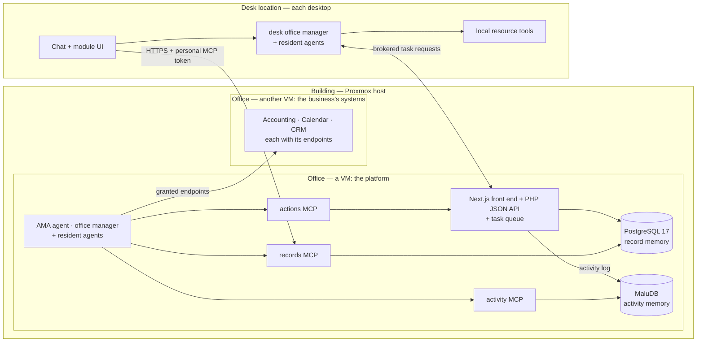

# Business OS Requirements

2026-09-16 · Edward Honour

> Living review copy: https://claude.ai/code/artifact/ac7f0526-7abf-4734-b72e-390206c3f2aa
> Comments and edits happen there; this file is the repo snapshot.

## Product vision

**Refocused 2026-09-22 — the OS is a kernel.** After looking at the application as built, the consensus was that too many business applications had been built into the operating system. The Business OS now manages **the AI agents, the humans who administer those agents directly, and single sign-on** — and, like a real operating system, leaves the use of the applications to the applications. Three names for a typical company (Subello, a restaurant): `www.subello.com` is the public website (out of scope, a design fixture); `os.subello.com` is this platform — the operating environment, locations, company structure, the definition of every human user, the agent workforce — used only by agents and by super-admins; `app.subello.com` is the single sign-on landing page and launcher for every human who works here; and each application (`hr.subello.com`, `reservations.subello.com`, …) is a separate Apache/PostgreSQL/PHP/HTMX application with full MCP coverage and its own expert agent, signed in by the platform. Every business module built into the platform before this date is removed, tables and all; HR is the first application, after the integration skill and the shared design are in place; the desktop companion is deferred. The design is `docs/business-os-integration.md` (live: https://claude.ai/code/artifact/7f923c54-5189-41ee-bdb0-95cd6610ccfa) and the application-side contract is the `maludb-os-integration` plugin, 0.2.0. Paragraphs below that describe business modules inside the platform are kept as the record of what was built and stand superseded where they conflict.

The Business OS is one system a small or medium-sized business — or an independent AI agency — runs itself on: records, activity, documents, and an AI layer that can answer any question about the business and act on it. It ships in two parts — a server platform on a dedicated VM, the business's own or one we host (Ubuntu 24.04, a Next.js/React front end over a PHP JSON API, on PostgreSQL 17 + MaluDB, exposing MCP servers from the backend) and a desktop companion that brings the owner's local resources (files, spreadsheets, email archives, local AI tools) into the same memory.

It is memory-first: every record and every action is captured from day one into two memories — record memory (the operational database) and activity memory (the append-only stream MaluDB ingests) — so the AI layer can answer "what happened, who did it, and why" and not just "what is".

The starting point is the members-vip fork already installed in this repository: its authentication, row-level security, activity log, MCP server trio (records, activity, actions), and assistant command bar are the proven foundation. The membership-specific modules (exams, attempts, study plans) get replaced by business modules; the architecture stays.

**How a business gets it, and what it does first** *(the owner's statement of the vision, 2026-09-21)*. The platform is installed on a dedicated server — at minimum one VM running Ubuntu 24.04 with PostgreSQL 17 and the MaluDB memory system — by an **installation agent we provide**. The business may run that VM itself or have us host it: it is one product either way, and every installation is always its own VM and its own database. The installation agent sets the platform up and then stays to watch over it *for the owner*: **nothing it sees leaves the server**. Once the server stands, setup runs in this order:

1. **The machines.** The owner identifies the other machines the business works on.
2. **The desktop.** The desktop companion is installed on them, and each is enrolled as a desk. *(Deferred 2026-09-22; until it exists a person meets an agent in an application's command bar.)*
3. **Locations, departments and applications — in any order.** The locations; the departments; and what the business will run, chosen from a curated catalog of **memory-first, ask-me-anything applications we built**, all hosted on the business's own server so its data stays sovereign — plus whatever else it already uses, registered.
4. **The experts.** Every application the business runs has an AI agent that is its subject matter expert, and every department has one too. The platform proposes each expert — name, job description, skills, access — and a person confirms the hire with one click, so a model, a budget and a manager are always a person's decision. An application that comes from us brings the skills that give its expert immediate expertise in using it.

An application that does not come from us is reached through its MCP server, provided one exists.

**Who it is for.** A small or medium-sized business running its own operations, and an independent AI agency. We help an agency with its own installation; the agency runs its business on it, may put its agents to work for its clients from it, and may resell the platform — each client a separate installation on its own VM with its own database, never a shared one.

## Goals and non-goals

Version 1 succeeds when a small or medium-sized business can run daily operations in the platform, ask the assistant anything about its records and history, and reach the same brain from the desktop app with local files included.

Goals:

- ~~Replace the cert-study modules with core business modules on the existing shell (auth, RLS, activity log, assistant bar all reused).~~ *(Superseded 2026-09-22: the platform is a kernel; business modules are separate applications.)*
- Expose the whole system through MCP so any AI client — ours or the customer's — can read records, read activity, and take actions with the member's own permissions.
- Ship a desktop companion that connects to the hosted MCP backend and adds local resources (files, folders, spreadsheets) to what the assistant can see.
- Keep each business's data sovereign: dedicated database and memory per client (SaaS Plus+), full export at any time, never used for training.

Non-goals for v1:

- No mobile native apps (the web UI is already mobile-first).
- No multi-business consolidation views or franchise roll-ups. *(2026-09-21: this holds for an agency too — each client it resells to is a separate installation. How an agency works across its clients' installations is an open question below, not a shared schema.)*
- No offline-first sync engine in the desktop app — it is a connected client with local-resource access, not a replica.
- No marketplace of third-party plugins; MCP is the extension surface. *(2026-09-21: the curated catalog of applications we built ourselves is not a marketplace — nobody else publishes into it.)*
- No statutory payroll: the platform records employment, pay runs and leave, and posts them to the books; tax calculation, withholding tables and filing stay with the accountant or a payroll provider.
- No warehouse management or manufacturing: stock is tracked by product and location with movements and purchase orders, not by bin, lot, serial number or bill of materials.

## Users, roles, and tenancy

Each business is one tenant with its own dedicated PostgreSQL database and its own MaluDB memory (SaaS Plus+). There is no shared multi-tenant schema; isolation is physical, and a tenant can take its database with it.

**Three roles, and only three.** The ladder is deliberately short: one person administers the system, some people administer their own departments, everyone else works here.

| Role | Who | Can |
| --- | --- | --- |
| **Super-admin** | The business principal | Everything, everywhere: billing, users, roles, departments, data export, MCP token policy, every module and every record. **The only humans who sign in to the kernel (`os.<domain>`)** *(2026-09-22)* |
| **Dept-admin** | Runs one or more departments | Everything **inside the departments they administer** — records, people, grants, approvals — with no module grant needed there. Outside those departments they are an ordinary user, so administering Sales reveals nothing about Finance. *(2026-09-22: a directory fact that travels with the sign-on token; what it allows inside an application is that application's rule. Not a kernel user.)* |
| **User** | Everyone else, human or AI | The modules granted to them, within the departments they belong to, plus records with no department, plus anything they own or are assigned |

Two attributes sit beside the role rather than inside it:

- **Departments.** A person belongs to as many departments as their work requires, and a dept-admin administers a named subset of theirs — being a member of Finance does not make a Sales dept-admin an administrator of Finance. The departments someone administers are the ones they are flagged admin of, plus any department they are the named manager of.
- **External.** The accountant, a contractor, a customer with a portal login: a *user* with the external flag set, never an administrator. They see only the modules explicitly granted to them (this is how the accountant sees all invoices, read-only) and the individual records shared with them.

Agents are always users. A constraint in the schema refuses an agent any administrative role, so an AI acting for someone sees exactly what that person's grants allow and never more.

Every database session carries `app.member_id` alone; the role, the departments, the administered departments and the grants are all looked up from it, so a role change takes effect on the next query and the MCP servers need no change. Row-level security and the `mcp_*` views enforce visibility for humans and agents identically.

## Departments and the AI agent workforce

The platform is also HR for AI agents: the business organizes into departments, and each department has human and AI members working side by side. An AI agent is a first-class member — hired, supervised, reviewed, and offboarded like staff, never an anonymous integration.

- **Departments.** Named org units (Sales, Operations, Finance, Support, …) with a manager. Every member — human or agent — belongs to one or more departments; tasks, tickets, and records can be scoped to a department, and visibility rules extend to department membership.
- **Every department has a lead agent** *(2026-09-21 — to build)*. One agent per department is both its **subject matter expert** — the one people and other agents ask about the department: its handbook, procedures, records and history, with the department's skills and memory behind it — and its **orchestrator**: it receives work addressed to the department, delegates to the department's other agents, and reports to the department's human manager. It is an orchestrator in the sense below, so delegation stays one level deep. The platform proposes the lead when a department is created — the five standing departments included — and a person confirms the hire with one click; a department without one is shown as a gap, never refused. Being the lead grants nothing: what it can see and do is its grants, like any agent.
- **Agent employee record.** An agent is a member row plus an employment profile: name, job description (its system prompt), department(s), human manager, model and API configuration, tool grants (which MCP tools and actions it may use), working schedule (its recurring duties), and a spend budget.
- **Three kinds of agent** *(voice added 2026-09-18)*. An **orchestrator** may hold a roster of subagents and delegate to them; a **subagent** does the work and never re-delegates, which is what keeps delegation one level deep and structurally cycle-free; a **voice agent** answers inbound calls, its system prompt read by the telephony provider when a call arrives, and takes no part in delegation at either end. A voice agent is an ordinary employee in every other respect — manager, model, prompt version, tool grants, budget, evals, prompt ledger. Wiring one to a phone number is its own slice.
- **Every agent has a face.** The profile photo is uploaded and held with the tenant's own files, not linked from somebody else's server: it survives, it leaks no request to a third party from every screen the agent appears on, and it leaves with the tenant's data.
- **The HR lifecycle.** Hire = provision the member, its token, and tool grants. Onboard = job description plus the department handbook in its context. Review = a performance view built from its activity trail: actions taken, tasks closed, escalations raised, spend against budget. Adjust = edit grants, prompt, or schedule. Offboard = revoke tokens and archive the trail — never delete it.
- **Supervision and escalation.** Every agent reports to a manager: a person, or an orchestrator agent *(2026-09-18 — an orchestrator already holds a roster and delegates to it, so managing what it delegates to is the same job stated twice; a subagent and a voice agent manage nobody)*. Actions above configured thresholds — money out, deletions, external sends — pause for the manager's approval; escalations arrive as notifications or tickets. **Open for the approvals slice:** whether an agent manager may answer those approvals itself, or must pass them to the nearest person above it.
- **Accountability for free.** The activity log is the agent's timesheet: "what did the marketing agent do last week, and why" is an ordinary activity question — no new machinery.
- **Work assignment.** Agents are assignable to tasks and tickets exactly like staff, and pick up recurring duties from their schedule.

**Four departments exist in every implementation** *(Front Office added 2026-09-18)*. A business adds Sales, Operations or whatever else it needs, but these four are created with the tenant, cannot be deleted or archived, and own the work that makes an agent workforce accountable. They can be renamed (Executive, People Ops, Finance, Quality) and they are staffed like any other department — by humans, by agents, or by both. **The Front Office is the root of the org chart: every other department reports to it**, directly or through another department, and a department saved without a parent named is parented there by the database rather than left floating. It works at an onsite location by default — a department may sit anywhere, but the front of the business belongs on a machine we run.

| Standing department | Owns | Answers |
| --- | --- | --- |
| **Front Office** | The front of the business and the people who run it: the CEO, the COO, reception, and whoever else meets the world first. Every other department reports here | "Who runs this business, who answers the door, and what does the org chart look like?" |
| **HR** | Everyone who works here, human and agent: the employee records, job descriptions, hiring and onboarding, tool grants, duties, reviews, escalations, offboarding | "Who works here, what is each one allowed to do, and how are they performing?" |
| **Accounting** | *(2026-09-22)* The meter on the workforce only: token usage and model cost in dollars per provider, model, department, agent and application, rolled up into a period statement and **exported** — as a file, an internal feed, or the `ledger_period` MCP tool — to the accounting system, which is an optional application from us. The kernel keeps no books | "What did the AI cost us this period, by whom, and what did we hand the accountant?" |
| **Audit** | The evaluations *(on demand since 2026-09-20; scheduled by the Auditor agent since 2026-09-27)*: the suites with their goals and thresholds, the runs a person starts when a change is weighed or work seems to slip, and the comparison with baseline | "Are the agents still accurate, and what slipped?" |

The Accounting department is why AI spend is not a separate universe: the prompt ledger is the subledger, a period roll-up per provider and department is the statement the accountant receives, and "what did we spend in August" includes the agents. The Audit department is why degradation is a record rather than a report: each threshold breach, regression against baseline, drift in sampled traces, or missed cycle opens an alert that someone must acknowledge and resolve, and it lands on the agent's HR performance view.

## The estate: buildings, offices, desks, and applications

The platform models where the business physically exists, because that is where agents run and where the systems they use live. The model is deliberately the office metaphor: **a building contains offices, offices contain people and applications, and some people work from a desk at home.**

- **Building.** The host: a Proxmox server (or the premises it stands in). It carries its own facts — platform, host reference, address, CPU, memory, storage — and contains offices.
- **Office.** A VM inside a building. Departments work in offices, agents run in them, and the applications a department owns are installed on them. An office is always on.
- **Desk.** An enrolled desktop. A human works there, resident agents run there while it is online, and it reaches local files the server never sees. Desks are where humans and agents work remotely.
- **Residents.** Every member — human or agent — is a resident somewhere: agents in their office or on a desk, humans at their desk. "Which office does the bookkeeper run in, and who is working remotely right now" is an ordinary question.
- **Who lives where.** People and agents may work at any office or desk. Nobody resides in a building: a building is the host, and its offices and desks are where work happens. *(2026-09-18: a managed/unmanaged "control" field briefly decided which hosts could carry agents. It refused hires over how a location happened to be recorded, and was removed from the product the same day — first the rule, then the field. A business does not need the platform's opinion about which machines it runs.)*
- **Siting: onsite or offsite** *(2026-09-18)*. An office or desk is **onsite** when it runs on a VM inside our own host, **offsite** when it is reached over the internet. It is recorded rather than inferred from the tree, because the minimum platform is one office with no building recorded and it is emphatically onsite, while a parent building may belong to somebody else. A building has no siting of its own.

**The minimum platform.** This is the smallest thing a business can run the Business OS on, and it is what the provisioning script creates:

- **One office** — a single VM running Ubuntu 24.04 with Apache + PHP, **PostgreSQL 17** (record memory), the tenant's **MaluDB** memory database (activity memory), the three MCP servers, and the agent runtime. It runs fine on 2 vCPU / 4 GB RAM / 40 GB; 4 vCPU / 8 GB / 100 GB SSD is the recommendation for a business of about ten people. No GPU: agents run on API keys, and local models are an optional extra office, never a requirement.
- **One desk** — an enrolled desktop, usually the owner's, to run the business from. The web UI works from any browser, but a desk is what brings local files, the drop folder, and resident agents into the same brain.
- **From outside the VM**: a model-provider API key, a domain and TLS certificate, MaluMail for outbound mail, and a payment provider if you invoice.
- **No building is required at this size.** A building is recorded when one host runs several offices and you want to see what shares a machine.

**How it grows.** Every step is adding a location, never a migration:

| When | You add |
| --- | --- |
| A department or an application wants its own machine | Another office (VM) on the same host |
| One host now runs several offices | The building above them, so capacity and blast radius are visible |
| Someone joins, or wants their own machine in the loop | A desk |
| You want local models or GPU work | An office with the GPU, registered like any other |
| A second business | A separate tenant — its own database and memory, never a shared schema |

Nothing about the design assumes Proxmox specifically — a building can be a cloud account or a rented rack — but the Proxmox host is the reference implementation.

**Applications.** The systems a business runs — the accounting system, the calendar, the CRM, mail, document storage, this platform itself — are first-class records, not configuration. Each one:

- **resides at a location** (an office VM, usually; sometimes a desk) and is **owned by a department**, with an accountable human;
- exposes **endpoints** — an MCP server, an HTTP API, a database, a filesystem share, a web UI — each with its auth kind and a *reference* to a tenant secret. The credential value never appears in a screen, a view, an MCP tool, or a log row;
- is reachable **by any member with a live access grant**, human or agent, granted individually or to a whole department. An agent additionally needs the tool grants for the work, and only ever sees endpoints marked agent-reachable, so a human-only admin console is never handed to an agent;
- carries **health and cost**: last check, status, criticality, and a link to what it costs each month, so "what do our systems cost, and against which department" is an accounting question, not a spreadsheet;
- sits in a **business area** — the same areas the menu is grouped by (Everyday, Sales & Service, Finance, Operations, Human Resources, Administration, Technology & Infrastructure) — and the Applications screen is an **inventory of cards** grouped by them: every application the business *could* run (the built-in modules plus a catalog of outside products), with the ones that run highlighted, so a person sees at a glance what the business has and what it could turn on or register;
- when it is active, has a **subject matter expert** — the agent people and other agents ask about it — and carries **skills**. An application's skills reach its expert and every agent that may use the application; naming an expert never grants access, and an expert without access is flagged as a gap. *(2026-09-21 — to build: the expert is no longer merely possible. When an application is installed, turned on or registered, the platform proposes its expert — name, job description, the application's skills, the access it needs — and a person confirms the hire with one click. An active application with no expert is a gap. Built today: a person names the expert by hand.)*

**Two kinds of application, one catalog** *(2026-09-21; the built-in kind removed 2026-09-22)*. The inventory a business chooses from holds:

| Kind | What it is | Choosing it means | Its expert's skills |
| --- | --- | --- | --- |
| ~~**Built-in module**~~ | ~~One of the platform's own modules — one codebase, one database~~ *(Removed 2026-09-22: the kernel's own screens — estate, departments, directory, agent HR, applications, approvals, AI Ops, skills, settings — are the operating system, not applications a business chooses)* | — | — |
| **An application from us** | A separate memory-first, ask-me-anything application we built on our standard stack (Apache, PHP, HTMX, PostgreSQL 17 + MaluDB), with its own database, its own memory and its own MCP servers | The installation agent installs it **on the business's own server**, registers it and its MCP endpoints, and proposes its expert | Shipped with the application and assigned at application scope on install, so its expert — and every agent allowed to use it — knows how to work it from the first day |
| **Anyone else's** | A product the business already uses (the curated list of outside products, or one it adds) | Registering it and its endpoints | Whatever the business writes or the expert learns |

- **The platform signs people in.** An application from us keeps its own screens, but not its own accounts: the platform is the one identity, and a live application access grant is what admits a member to it. One permission system still. *(Designed 2026-09-22: a house-signed **hand-off token** — 60 seconds, single use, bound to the application — minted on the launcher at `app.<domain>` and received at the application's `/sso`; the application mirrors the directory with the kernel's ids and refreshes it from a change feed; HR alone changes the directory, through the kernel's **directory API**, as the acting person. No OpenID Connect. `docs/business-os-integration.md`.)*
- **The agents that run an application come with it** *(2026-09-22)*: the expert and any working agents are defined in the application's repository, proposed on install, confirmed by a super-admin, and then hired and run by the kernel — every model call through the kernel's ledger proxy; an application never holds a model key. The application's own voice-first command bar runs its expert through the kernel's chat endpoint.
- **Existing applications are adopted, and an application may serve several locations or departments** *(2026-09-25)*. The OS integrates applications that already exist on our PHP/HTMX framework, not only ones we build — the first is ZozoCal-Restaurant. An adopted application keeps its own users table, linked to the kernel's member (`os_member_id`), and keeps working on its own when the OS is switched off. One installation may be **scoped**: each restaurant a location (a new location kind, `site` — a place the business trades from, not a machine), or each department its own project plans. The application declares its scope and its own roles; a grant names a scope and a role. **Application users are not OS users by default**: a member reaches an application only through an explicit grant, and nothing on `os.`. Fresh installs only for now. Build plan phase 7, Part C; `docs/business-os-integration.md`.
- **Agents reach every application through MCP.** For ours, the MCP servers ship with it. For anyone else's, an agent can work in it **provided an MCP server for it exists**; without one the application can still be recorded — owner, cost, health — but no agent can be granted tools on it.
- **Where ours come from.** Each application is its own repository; a dedicated GitHub organisation for them is proposed, from which the installation agent pulls releases. *(Open below.)*
- **Each application from us has its own name, and its own virtual host on the office's Apache** *(2026-09-21)*. Humans and agents reach an application independently of each other, so every application gets its own DNS name under the business's domain — `reservations.subello.com` for the appointment system, `crm.subello.com` for the CRM, `projects.subello.com` for project management — and the one Apache on the office serves them all, each as its own virtual host with its own document root and PHP application, its MCP servers reverse-proxied under the same name. The virtual host is **by name, or by port**: with a reverse proxy in front of the office (the usual case — `subello.com` already reaches this server through one), the proxy maps each name to a port of its own on Apache — `reservations.subello.com` → :81, `crm.subello.com` → :82 — and without one Apache tells the names apart itself. The platform keeps the business's main names — `os.<domain>` for the kernel and `app.<domain>` for sign-on and the launcher *(2026-09-22)* — and :80. The installation agent writes the virtual host, the proxy entry when the proxy is ours, and obtains the certificate wherever TLS terminates (a wildcard certificate for the domain is the recommendation, so a new application needs no new certificate); the DNS record is the owner's to create, or ours when we run the hosting. The registry records the name as the application's `url`, the port on its endpoints.

This is what makes the workforce portable: an agent asks what it can reach, gets the endpoints its grants allow, and does the work — whether the accounting system is on the Finance VM, on the owner's desk, or hosted by a vendor.

**Orchestration.** Departments say who an agent works for; locations say where it runs and what it can reach.

- **Office manager per location.** Each location has exactly one office-manager agent — its orchestrator. It receives task requests addressed to the location, routes them to the right resident agent, tracks progress, and reports back. The Office's manager is the tenant's default entry point.
- **Department lead per department** *(2026-09-21)*. Work addressed to a *department* goes to its lead agent; work addressed to a *location* goes to its office manager. The two do not compete: the office manager knows what runs on a machine, the lead knows the department's work. In the minimum platform — one office — whether the Office's manager and the Front Office's lead are one agent is an open question below.
- **The installation agent** *(2026-09-21 — to build; the application half built 2026-09-27)*. One agent we provide sets the platform up — the office VM, the database and its roles, the MaluDB memory, the services, the five standing departments — installs the applications the owner chooses, and afterwards monitors the installation: versions, service health, disk, backups, usage. It works for the owner. **Nothing it sees is reported to us**; we see an installation only when its owner opens a support session. It is the same agent whether the business runs the server or we host it. *(2026-09-27: ongoing monitoring moved to the Sysadmin in IT. **IT is the fifth standing department**, created on install, and the **application installation agent** is hired into it on install: it helps install and integrate applications — from us, adopted, or third-party through MCP — with the integration contract as its skills; it plans, a person approves each registration by policy, it applies through the kernel, and it writes the files root must install rather than touching the server itself. Standing the server up remains to build.)*
- **Cross-location tasking.** A desk can use Office agents directly, and can request another desk to perform a task. All cross-location requests are brokered by the server task queue — requester → server → target location's office manager → resident agent — never peer-to-peer, so the server remains the single audit point.
- **Consent.** A task on someone else's desk touches their machine: the desk owner grants standing permissions (per requester or per task type) or approves one-off requests; every cross-location task logs at both ends.
- **Offline handling.** Tasks for an offline desk queue at the server and deliver on reconnect; the requester sees queued/running/done status throughout.
- **Managing the estate.** Buildings, offices, desks, applications, endpoints and access grants all have screens, actions and MCP tools like every other module — adding a VM, moving an office to another building, registering an application, granting a department access to it, retiring a desk. The estate is data the business manages, not a config file an admin edits.

## Agent runtime, telemetry, and evaluation

Agents run on API keys, in whatever harness suits the model. The employee record selects a model; a harness registry maps every supported model to the SDK best suited to run it. All harnesses sit behind one agent-runner interface — job description in, MCP tools attached, actions and spend metered — so office managers, approvals, budgets, and the activity log behave identically whatever runs underneath.

| Model family | Harness | Auth |
| --- | --- | --- |
| Claude (default; office managers and the AMA agent use the most capable current model) | Claude Agent SDK (Python) *(built 2026-09-20 — the CLI in print mode, sandboxed as its own unix user with no network beyond localhost; `--bare` makes an API key the only way it can authenticate)* | Tenant's Anthropic API key |
| OpenAI | OpenAI Agents SDK | Tenant's OpenAI API key |
| Chinese providers (DeepSeek, Zhipu GLM, Moonshot Kimi, Qwen) | Best fit per provider: native SDK, or a Claude/OpenAI-compatible endpoint into one of the harnesses above | Tenant's provider API key |
| Local (Ollama or vLLM on the office server or a desk) | OpenAI-compatible harness against the local endpoint | None — stays on premises |
| Any family above, run as a learning agent *(2026-09-19 — the first harness built)* | **Hermes Agent** (Nous Research), wrapped at a pinned release — never forked — behind the same interface. Its own scheduler, delegation, gateway and built-in memory are switched off: the platform stays the organisation | The same tenant API key, held by the ledger proxy; the agent never sees it |

Adding a model is a registry entry (model → harness + config), never a code change elsewhere. Subscription auth (Pro/Max) is out of scope: the Agent SDK terms require Anthropic's prior approval to offer claude.ai login in a product, so the platform assumes API keys throughout.

**Hermes first, MaluDB underneath** *(2026-09-19)*. The first harness built is Hermes Agent, because it brings a working agent loop — tool calling over any provider, an MCP client, self-authored skills, context compression — on day one. What it keeps privately per instance is replaced by what the organisation shares: **memory is MaluDB**, read through the platform's Memory MCP server and written through the same PHP handlers as every other change, scoped to the agent, its departments, or the whole organisation; **skills are MaluDB skill bundles**, assigned by the platform, synced read-only into each run, and a skill an agent writes reaches another agent only after its manager has read the diff. The other harnesses in the table remain on the same interface. A conformance suite (`mcp/hermes_conformance/`) proves every seam against the pinned release and is rerun on every upgrade. Plan: `docs/hermes-integration-plan.md`.

**Execution telemetry — the prompt ledger.** Every model call from every harness is recorded in the tenant's database — by a pass-through proxy that every harness's model traffic is routed through *(2026-09-19: a harness's own hooks do not see its auxiliary calls — compression, titling — so only the wire is complete; the proxy also holds the provider keys and refuses a call once the agent's budget is spent)*: timestamp, agent, location, harness and SDK version, provider and model, the full context window sent (system prompt, messages, tool definitions), the full response (text and tool calls), token counts (input, output, cache read/write), latency, and cost — linked by request id to the activity-log entry for the action it produced. A Prompt Log screen and MCP tools expose it; retention of full payloads is tenant policy (metadata keeps indefinitely, payloads archive on schedule). The ledger is also the Accounting department's subledger for AI cost: each period's usage rolls up per provider, model, department, agent and application into a period statement that a super-admin closes and exports *(2026-09-22 — no longer posted to books inside the platform; the accounting system is an optional application that receives the export)*.

**Evaluations from the ground level — on demand, never automatic** *(revised 2026-09-20)*. Evals belong to the Audit department. They exist to refine the agents once they have worked for a while: a person runs them when weighing a model or prompt change, or when an agent's work seems to have slipped. Nothing runs an eval by itself, and **a missing eval never blocks a change**. What is not optional is the evidence: every agent — the command-bar assistant included — records, while it works, what an evaluation will later need: the full prompt and context of every model call, the response, the model and its settings, token counts, latency and cost (the prompt ledger); every tool call with its outcome and duration; the configuration version, skills and handbook in force; every action taken. None of that can be backfilled.

**Revised 2026-09-27 — scheduled evaluations, and two JEV agents.** The owner reversed "on demand, never automatic": an **Auditor** agent in the Audit department runs the eval schedules, samples real agent runs and grades them with JEV's checks, and checks the audit trail is whole (every run ledgered, every evaluation changed nothing). Its findings still **advise** — nothing suspends, blocks or changes an agent; a person decides. A **Sysadmin** agent in IT does all ongoing monitoring of the server, read-only: services, disk, memory, backups, versions, and the logs and guardrail events, redacted before anything is read. Both run on a new built-in harness, `system_one`: shipped playbooks whose judgements are JEV's, starting in shadow (recording what they would do, sending nothing) until a person switches them live. `docs/build-specs/system-one-harness.md`.

- Goals first: a suite states the product promise it tests and its thresholds — overall and per dimension, the severity rule, the regression tolerated from baseline, cost and latency budgets, trials per case — before a run, and each run keeps the thresholds it was judged by.
- Hiring: a new agent goes live on the configuration it was hired with *(2026-09-18 — a version written seconds ago has nothing to have been evaluated against, so a gate there could only refuse every hire or be waived for every one)*. Its first graded run is the one that tells you whether the model and harness were the right choice.
- Change control: when a change is being weighed, the suite is run on demand against the candidate — a draft version, another model, another prompt — and compared case by case with the baseline of the live version. The decision is the person's. A version that goes live unevaluated says so, on the screen and in the log.
- Degradation: when work seems to slip, the suite is run on demand against the live version and compared with its own baseline.
- One-action promotion: any real trace in the prompt ledger can be promoted into an eval case, so the suite grows from real work.
- Not used: standing schedules, periodic grading of sampled traces and automatic degradation alerts. Their tables exist and stay empty.

**The runner** *(built 2026-09-20)*. A run takes a suite's active cases, runs each **three times** — all three must pass — grades them (an exact match, a deterministic check, a model judge from another family, or a person), scores what has been graded and compares case by case with its baseline. **An evaluation cannot change anything**: a write tool under an eval run records what it would have done and never sends it, enforced where tool grants are enforced and checked again after every trial. That is what makes a suite something anyone can run on a Tuesday afternoon.

## System architecture

Two deployables share one brain. The hosted platform owns the memories and the MCP surface; the desktop app is an MCP client that also carries local tools the server can never reach.

Reading the diagram: the minimum platform is the left-hand office plus one desk; the building and the second office appear as the business grows. The building is the host, and each office is a VM on it — the platform in one, the business's other applications in others, reachable by any agent holding a grant. The browser UI and the assistant bar talk to the PHP app as today. The three MCP servers (records read-only, activity read-only, actions) are reverse-proxied by Apache under bearer-token auth — the same endpoints serve the Office's agents, every desk, and the customer's own AI tools such as Claude Desktop. Each location runs its own office manager and resident agents; cross-location task requests always pass through the server's task queue, never desk-to-desk, so one audit trail covers all of it. Local files never transit the server unless the user explicitly attaches or imports them.

## Server platform — core business modules

**Superseded 2026-09-22.** Every business module in the table below was built (2026-09-18 to 2026-09-21) and is now **removed from the kernel** — code, screens, MCP tools, manifest entries and tables — under the refocus stated in the product vision. The kernel keeps: Dashboard (the workforce), Team & access (the directory), Departments & agent HR, Estate, Applications, Approvals, AI Ops, Skills & memory, Settings. Each removed module becomes an application from us when a customer needs it; People & payroll becomes the HR application, first. The table stays as the record of what was built and what a future application will replace. The exact inventory of the cut is in `docs/business-os-integration.md`.

The v1 module set covers the operating loop of a small service business: know your people, sell the work, do the work, bill the work, see how you're doing. Several modules are conversions of screens the fork already has.

| Module | Answers the question | Builds on (from fork) |
| --- | --- | --- |
| Dashboard | "How are we doing right now?" | dashboard |
| Contacts & CRM | "Who do we know, and where does each deal stand?" | members, invitations |
| Projects & tasks | "What work is promised, to whom, by when?" | plans, plan items |
| Scheduling & calendar | "What is happening this week, and who is booked?" | events, calendar, iCal feed |
| Sales & invoicing | "What did we quote, bill, and collect?" (including online payment collection) | new |
| Expenses & money out | "What are we spending, and on what?" | new |
| Tickets & requests | "What has a customer or teammate asked us to fix?" | issues |
| Documents & knowledge | "Where is the file / procedure / reference?" | resources |
| Time & work log | "Where did the hours go?" | study_log |
| Team & access | "Who works here and what can they touch?" | members, settings, 2FA, tokens |
| Notifications & digest | "What needs my attention?" | notifications, email digests |
| Departments & agent HR | "Who — human or AI — works in each department, and how are they performing?" | members, settings (new screens) |
| Content & social | "What are we publishing, where, and is it working?" | new |
| Bookkeeping & the ledger | "What do the books say — P&L, balance sheet, what is reconciled?" | new |
| Shared inbox | "What has come in, who is answering it, and how fast?" | new |
| People & payroll | "Who works here as a person, what are they paid, and who is off?" | new |
| Products & inventory | "What do we sell, what is in stock, and what must we reorder?" | new |
| E-signature | "What is out for signature, and who have we signed with?" | new |
| Customer portal & forms | "What can customers see and send us themselves?" | new |
| Reporting & dashboards | "Save that question, run it monthly, put it on a screen" | new |
| Estate | "What buildings, offices and desks do we have, what runs where, and who works there?" | new |
| Applications | "Which systems do we run, who owns them, who and which agents can reach them, and what do they cost?" | new |
| Assets | "What do we own and operate — physical and technical — which department does each belong to, where is it, who holds it, and what is due on it?" | new |

**Company profile (2026-09-20).** The platform also describes the business itself: a **Company** page every insider can read — name, tagline, about, mission, facts (founded, industry, headquarters, team size), contact details, social links, logo and hero image — and a curated list of what the business offers: catalog items, inventory products, or free-form showcase cards, each with its own words, picture, price display and order. Identity (name, address, email, phone, website) stays in business settings, one source of truth; `tax_id` is never part of the profile. A super-admin edits and **publishes** it; published, it is served as one versioned JSON document (`GET /api/v1/company-profile`, pictures at `/api/v1/company-profile-media`) to a bearer token — **the source a simple display website is built from**, never readable without a token — and the same document answers the `company_profile` MCP tool, so an agent can build or update the site. It is not a module: reading needs no grant, editing is super-admin only, and an agent's request to publish pauses for a person. Building and hosting the website itself is outside the platform.

**Every built-in module is registered as an application** *(2026-09-22: superseded with the modules; the registry holds the kernel's platform row and the applications from us or from others)*. The registry above does not hold one row for "the platform": it holds CRM, Sales, Books, Inbox, Calendar, Documents and the rest, each at the office it runs on, each with its endpoints. They share a codebase and a database today — the registry records where a thing runs and how it is reached, not how it is packaged — which is what lets any one of them move to its own office later without a redesign. There is still only one permission system: a **module grant** is what admits a member to a built-in application, while **application access** is what admits them to an external system. Agents need both their tool grants and, for anything outside the platform, an access grant.

Each module ships as a vertical slice per the plugin's fixed build order: schema + RLS + views first, then screens (React, in the Bootstrap 5.3 look, per the design system), then its named MCP tools and action-manifest entries — a module is not done until the assistant can query it and act on it.

Every write in every module logs to `activity_log` (who, what, when, where, before/after) from the first deploy — activity memory cannot be backfilled.

## AI assistant and MCP requirements

*(2026-09-22: the kernel's own command bar and assistant service are removed — a super-admin uses the kernel's screens. Points 1 and 2 below now describe an application's command bar, which posts to the kernel's chat endpoint and is answered by the application's expert, run by the kernel. Points 3–6 stand.)*

The assistant is the product's front door, not a bolt-on. Requirements:

1. **Ask-me-anything agent.** The hosted AMA service (Claude Agent SDK, Python) answers record questions through the records MCP server and activity questions through the activity MCP server, always scoped to the asking member's rights. Target: any question a screen can answer, the agent can answer; the screens exist for the frequent ones.
2. **Voice-first command bar on every screen.** The existing assistant bar carries forward: natural language (typically dictated) in, navigation and actions out. Every module action that has a button must also have an entry in the action manifest so it is reachable by phrase.
3. **Three MCP servers per tenant**, reverse-proxied under bearer auth: records (read-only role, `mcp_*` views only), activity (read-only role, `mcp_activity_*` views only), actions (executes the same PHP endpoints the UI uses, with CSRF replaced by the signed action token). Tool surfaces are designed from the module question inventory: named tools for recurring questions plus one guarded read-only search tool for the long tail.
4. **Customer-connectable.** A member can mint personal MCP tokens (existing `settings/tokens` flow) and point Claude Desktop, Claude Code, or their own agents at their tenant's endpoints. This is a headline feature of SaaS Plus+, not an admin backdoor.
5. **Auditable agency.** Every action taken by an agent logs to `activity_log` with `source = 'assistant'` or `'mcp'`, so "what did the AI change and when" is itself an answerable activity question.
6. **Model configuration per tenant.** Model provider credentials and model choice (default: the latest Claude model) live in tenant config; no tenant's data is sent anywhere except its own configured model provider.

## Desktop companion

*(Deferred 2026-09-22. When it is built it is the place a person talks to an agent; until then, an application's command bar.)*

The desktop app exists for one reason the browser cannot serve: joining the business's hosted memory with resources that live on the owner's machine. It is a connected client, not a second implementation of the platform.

Requirements:

- **Same brain.** It authenticates with the member's personal MCP token and uses the hosted records/activity/actions endpoints — no separate API. What the member can see in the browser is exactly what the desktop assistant can see.
- **A location with resident agents.** Each install registers as a desk location and hosts its own office manager and resident agents (see Locations and orchestration); they serve local duties and brokered requests from other locations while the desk is online.
- **Local resource tools.** A local tool layer the hosted platform never has: read designated folders, open and summarize spreadsheets and PDFs, watch a drop folder for documents to file into the Documents module. Local scope is opt-in per folder, shown in a permissions panel, revocable.
- **Chat-first UI.** Primary surface is the assistant conversation with the module screens one click away (embedded web views of the hosted UI). No re-implementation of module screens natively in v1.
- **Explicit data movement.** Nothing local is uploaded silently. An answer may draw on a local file; the file itself reaches the server only through a visible attach/import step the user confirms.
- **Connectivity behavior.** Online-required for anything touching the hosted memory; when offline it can still browse local resources and queue imports. No sync engine, no local replica of the tenant database in v1.
- **Updates and platforms.** Windows and macOS first; auto-update channel; the app version may lag the server, so the MCP surface is versioned and additive-only within a major version.

## Data, memory, and sovereignty

Memory is designed before features: each module's schema is derived from its question inventory, and a question neither memory can answer is a modeling bug caught at design time.

- **Record memory** — the tenant's PostgreSQL 17 database. Schema in versioned `db/*.sql` migrations as today; RLS on every member-owned table; `mcp_*` visibility views are the only surface the read roles can touch.
- **Activity memory** — the append-only `activity_log` ingested continuously into the tenant's MaluDB (a dedicated memory database per tenant — here `certstudy_memory`, on `maludb_core` 0.105.3; the `maludb` database is only the extension's bootstrap). Ingestion has been live since 2026-09-16: `mcp/activity_ingest.py` ships every `activity_log` row to MaluDB as an episode.
- **Sovereignty (SaaS Plus+).** Per tenant: dedicated database, dedicated MaluDB memory, own MCP endpoints, own API keys. The owner can export everything — SQL dump plus activity stream — in one self-serve action, and the contract states client data is never used to train models. *(2026-09-21)* Every installation is its own VM and its own database, whether the business runs it, we host it, or an agency resold it; every application from us is installed on that same server, never on ours; and the installation agent's monitoring stays inside the installation — nothing is reported to us.
- **Retention.** Business records keep indefinitely; activity log is partitioned by month with archival (not deletion) as the default policy; deletes of people honor a right-to-be-forgotten flow that preserves financial records required by law.
- **Email.** All transactional mail through MaluMail with per-tenant from-addresses and suppression-list handling.

## Non-functional requirements

- **Security.** Carried from the fork and kept: hardened PHP sessions, CSRF on every form, TOTP 2FA, Google OAuth option, brute-force lockout, hashed personal tokens, HMAC-signed short-lived action tokens. New: per-tenant secrets isolation, MCP endpoints rate-limited per token, desktop app stores its token in the OS keychain.
- **Privacy boundary for AI.** The agent tier holds no credentials of its own; it can only present a member-scoped token. Prompt logs live in the tenant's own memory, not in a shared store.
- **Performance.** Server-rendered pages under 300 ms on a single Apache/Postgres host for a 10-person tenant; assistant answers under 10 s for named-tool questions. The baseline stack is kept until a measured requirement breaks it.
- **Operations.** One tenant = one office VM carrying one database + one MaluDB memory + three systemd MCP services + one AMA service, provisioned by script — the minimum platform above. The installation agent *(2026-09-21)* is what runs that script, on the business's server or ours, and what watches the result afterwards. Nightly dumps per tenant, restore rehearsed. Cron jobs (reminders, digests, invite expiry) per the existing `bin/cron` pattern.
- **Compatibility.** Mobile-first web UI per the design system; the desktop app tracks the hosted MCP surface via additive versioning.
- **Development discipline.** Vertical slices; every schema change lands as a numbered migration; every action logs; every module ships with its MCP tools and action-manifest entries in the same slice.

## Phasing and open questions

| Phase | Delivers | Depends on |
| --- | --- | --- |
| 1. Foundation | Business shell on the fork, MaluDB ingestion finalized, Contacts/CRM + Dashboard slice, mcp venv rebuilt | nothing — starts now |
| 2. Money | Sales & invoicing with online payment collection, expenses, the general ledger (chart of accounts, journal, bank reconciliation), products & inventory, money dashboards + their MCP tools | 1 |
| 3. Work | Projects & tasks, scheduling, time log, tickets, the shared inbox, content & social planning | 1 |
| 4. Knowledge & ops | Documents, e-signature, the customer portal & forms, reporting & dashboards, notifications/digests, content publishing connectors, the estate + applications registries, tenant provisioning script, export | 2, 3 |
| 5. Agent workforce | The five standing departments (Front Office, HR, Accounting, Audit, IT) and any others, people & payroll for humans beside agent HR, agent employee records, supervision & approvals, performance views, AI spend posted to the books, the eval watch, Office location + office-manager orchestrator | 2, 3 |
| 6. Desktop beta *(deferred 2026-09-22)* | Desktop companion on Windows/macOS with local resource tools, desk locations with resident agents, cross-location tasking | 7 |
| 7. The kernel and its applications *(restated 2026-09-22)* | The cut (every business module removed, tables dropped, the Accounting agents' duties rewritten around the ledger) → hosts (`os.` and `app.`, the launcher) → sign-on (the hand-off token) → the directory API → the ledger's period statement and export → the chat endpoint for applications' command bars → the items owed to the integration contract → **HR, the first application** — then the installation agent, first-run setup, proposed experts and department leads as listed in the next row | 5 |
| 7 *(as added 2026-09-21)* | The installation agent (install on the business's server or ours, then monitor — nothing leaves), the first-run setup (machines → desktop → locations, departments and applications in any order → experts), the catalog's separately installed applications from us with platform sign-on and shipped skills, proposed-and-confirmed experts for every application and a lead agent for every department, skills shipped for the built-in modules | 4 (provisioning script), 5 |

Open questions for review:

- [ ] Desktop shell technology: Tauri (small, native webview) vs Electron (heavier, most battle-tested). Recommendation: Tauri.
- [ ] First target vertical or customer — the module priorities in phases 2–3 should follow a real business's question list.
- [x] Invoicing scope in v1: documents + status only, or online payment collection (Stripe or similar) too? **Decided 2026-09-17: both.** First provider still to confirm (recommendation: Stripe).
- [x] Does "social media" positioning imply a content/post-planning module, or is that a later module? **Decided 2026-09-17: Content & social is a v1 module.** Open: plan-and-approve only, or direct publishing (recommendation: planning in phase 3, publishing connectors in phase 4).
- [ ] Product name and domain.
- [ ] Estate depth: building → office → desk is two levels plus desks. Do we need racks, sites or regions above buildings? Recommendation: no — the parent link already allows deeper nesting without a schema change.
- [x] Physical assets (vehicles, rooms, equipment): **decided 2026-09-21 — one Assets register** for everything the business owns and operates, physical and technical (relational databases such as PostgreSQL 17, memory systems such as MaluDB, MCP servers, domains, licences). Every asset belongs to a department and sits at a location, and may be held by a person or an agent. A bookable asset links to its scheduling resource (booking stays in Calendar); a technical asset links to the application it stands behind (endpoints, access and health stay in Applications — an asset grants nothing). Depreciation is straight line and posted to the books by a person, never automatically.
- [ ] Provisioning an office: does the platform create the VM (a Proxmox API integration) or only record one an admin created? Recommendation: record-only in v1, provisioning as a later connector.
- [x] Tenant provisioning: scripted-manual acceptable for the first N tenants, or self-serve signup from day one? **Decided 2026-09-21: an installation agent we provide installs the platform — on the business's own server or on one we host — and monitors it afterwards for the owner. Nothing it sees leaves the server.**
- [x] Who the product is for. **Decided 2026-09-21: a small or medium-sized business, or an independent AI agency** — which runs its own installation, may put its agents to work for clients, and may resell the platform, each client a separate VM and database.
- [x] What "an application from us" is. **Decided 2026-09-21: both** — the built-in modules, and separate memory-first applications on our standard Apache/PHP/HTMX stack that the installation agent installs on the business's own server. The platform signs people in to them.
- [x] How an expert comes to exist. **Decided 2026-09-21: proposed by the platform, confirmed by a person in one click** — for every application, and for every department, whose lead agent is both its expert and its orchestrator.
- [x] The minimum platform. **Confirmed 2026-09-21: one office VM plus one desk.**
- [ ] An agency across its clients: every client is a separate installation, so what does the agency see of them — nothing but a list of links, a support session the client opens, or agents of the agency's hired into a client's installation as external users?
- [ ] Licensing when nothing leaves the server: with no usage reported to us, what is a licence counted on, and how is an agency's resale recorded?
- [x] Sign-on for an application from us. **Decided 2026-09-22: a house-signed hand-off token** (60 s, single use, bound to the application) minted on the launcher at `app.<domain>`; the application mirrors the directory with the kernel's ids; roles travel with the token as directory facts. No OpenID Connect — we provide the applications.
- [x] Existing and multi-location applications. **Decided 2026-09-25:** adopted with their own users table linked to the kernel; scoped by location (`site`) or department with application-declared roles; application users are not OS users by default; standalone mode kept; fresh installs only; an adopted application's own model keys deferred.
- [x] What the platform is. **Decided 2026-09-22: a kernel** — agents, the super-admins who administer them, sign-on. Every business module is removed; HR is the first application; the accounting system is optional and receives the ledger's period export; the desktop companion is deferred; the public website is out of scope. `docs/business-os-integration.md`.
- [ ] Distribution: a dedicated GitHub organisation for the applications we provide — name, which applications go first, and how the installation agent authenticates to pull a release.
- [ ] One office, two orchestrators: in the minimum platform, is the Office's office manager also the Front Office's lead agent, or are they always two hires?
- [ ] May one agent be the expert of several applications, or lead several departments? The schema allows the first today. Recommendation: yes to both for a small business — the proposal defaults to reuse where an agent already fits.
- [ ] Outside products with no MCP server: recorded only, or do we build MCP servers for the common ones?
- [ ] Which department hires the first AI agent, and what is its job description?
- [x] Approval thresholds. **Decided 2026-09-22: approvals of agents' actions stay in the kernel and are decided by super-admins; applications carry no money-out actions of their own.**
- [ ] Prompt-ledger retention: how long to keep full context and response payloads before archiving (metadata keeps indefinitely).
